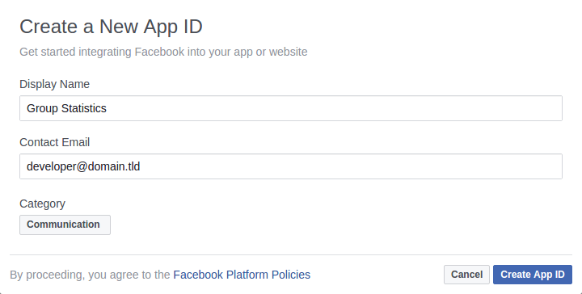

# [Documentation](/README.md#documentation)

## Installation

Local installation of this application consists of the following steps:


### Facebook Application

Create a new Facebook Application in [developers.facebook.com](https://developers.facebook.com)
from the `My Apps` menu:



For this script to work, the default settings will do:


### Composer

Install the code with [Composer](https://getcomposer.org/):

```bash
git clone git://github.com/wwphp-fb/stats
cd stats
composer install
```


### Configuration

The Composer installation script creates `app/config/parameters.yml` file
by asking for configuration parameter values. Configuration parameters are
described in comments in the [parameters.yml.dist](app/config/parameters.yml.dist).
Provide ID and secret code for your Facebook application, default Graph API version
and other configuration. Configuration is explained in more details in the
[configuration](configuration.md) chapter.


### Generate Report

Run the report generation:

```bash
bin/stats generate --from=2016-09-05 --to=2016-09-11
```

Before generation starts, you must also provide the user access token manually.

```bash
You must provide an access token.

Enter user access token from the Graph API Explorer
https://developers.facebook.com/tools/explorer

```

To generate the user access token, use
[Graph API explorer](https://developers.facebook.com/tools/explorer/) and
select the application created in step 1.


The only permission required for the application to work is the `user_managed_groups`.


## Docker

If you use Docker you can run this application with the [PHP Docker image](https://hub.docker.com/_/php/):

```bash
docker run --rm -it -v "$(which composer)":/usr/bin/composer -v "$(pwd)":/usr/src/stats -w /usr/src/stats php:7.0-cli composer install
docker run --rm -it --name stats -v "$(pwd)":/usr/src/stats -w /usr/src/stats php:7.0-cli bin/stats generate
```
